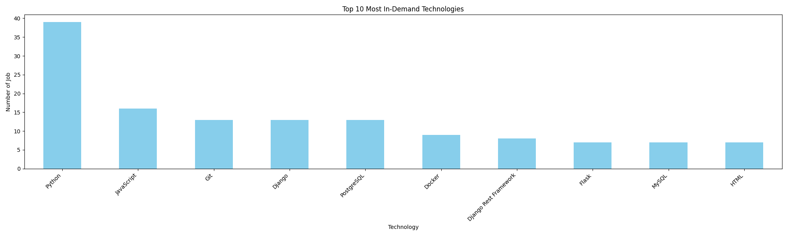

# Python Technologies Statistics - Work.ua

## Overview
This project aims to analyze the demand for various technologies in the tech job market, with a specific focus on Python development roles advertised on Work.ua.

## Objective
The primary objective of this project is to aid individuals in preparing for Python developer interviews by identifying the most sought-after technologies in the industry, as reflected in job listings on Work.ua.

## Methodology
- **Scraping:** I employed Scrapy methodology to extract job listings from Work.ua, specifically targeting Python developer roles.
- **Data Analysis:** Utilizing pandas, I analyzed the technologies mentioned in the job listings to identify the most frequently mentioned ones.
- **Visualization:** For visual representation of the analysis results, I used Matplotlib to create histograms for easy interpretation.

## Usage
1. Clone the GitHub repository to your local machine.
2. Run the scraping script to collect job listings data from Work.ua.
3. Execute the analysis module to process the collected data.
4. Visualize the analysis results using the provided scripts.

## GitHub Repository
[Link to GitHub Repository](https://github.com/juliastetsko/scraper-analyzer-work.ua.git)

## Technology histogram

